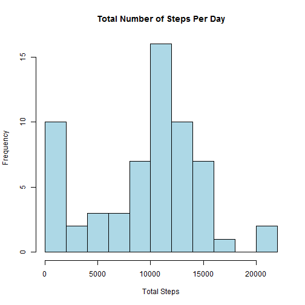
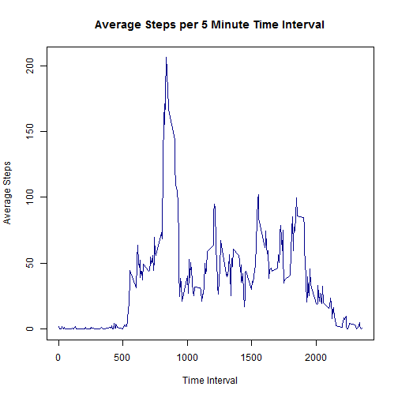
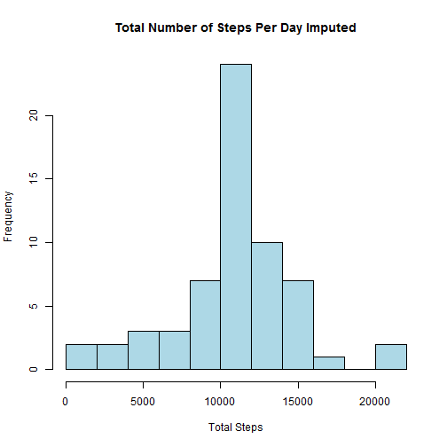
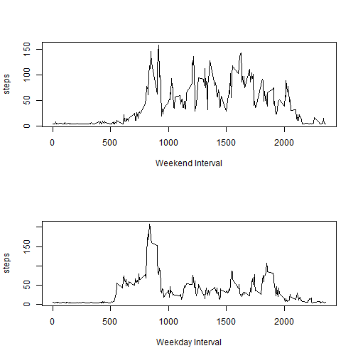

## Loading and preprocessing the data

I chose to do all processing within the section that was relevant to the processing needed. I think this makes it easier to understand why I did what I did when I did it :)


```r
activity <- read.csv("activity.csv")
```

## What is mean total number of steps taken per day?


```r
tot_Steps <- tapply(activity$steps, activity$date, sum, na.rm = TRUE)
hist(tot_Steps, breaks = 10, col = "light blue", main = "Total Number of Steps Per Day", 
    xlab = "Total Steps")
```

 

```r
summary(tot_Steps)
```

```
##    Min. 1st Qu.  Median    Mean 3rd Qu.    Max. 
##       0    6780   10400    9350   12800   21200
```

Using the summary function, we can see that the mean number of steps taken per day is 9350 and the median is 10400


## What is the average daily activity pattern?

```r
Avg_Steps <- tapply(activity$steps, activity$interval, mean, na.rm = TRUE)
plot(Avg_Steps ~ names(Avg_Steps), type = "l", col = "dark blue", main = "Average Steps per 5 Minute Time Interval", 
    xlab = "Time Interval", ylab = "Average Steps")
```

 

```r
max(Avg_Steps)
```

```
## [1] 206.2
```

```r
which.max(Avg_Steps)
```

```
## 835 
## 104
```

We can see, using the max and which.max functions, that the interval with the highest average number of steps is the 835 interval, and the max value is 206.2

## Imputing missing values


```r
activity_imputed <- activity
activity_imputed$steps[is.na(activity_imputed$steps) == TRUE] = mean(activity_imputed$steps, 
    na.rm = TRUE)
tot_StepsImputed <- tapply(activity_imputed$steps, activity_imputed$date, sum)
hist(tot_StepsImputed, breaks = 10, col = "light blue", main = "Total Number of Steps Per Day Imputed", 
    xlab = "Total Steps")
```

 

```r
summary(tot_StepsImputed)
```

```
##    Min. 1st Qu.  Median    Mean 3rd Qu.    Max. 
##      41    9820   10800   10800   12800   21200
```

```r
summary(tot_Steps)
```

```
##    Min. 1st Qu.  Median    Mean 3rd Qu.    Max. 
##       0    6780   10400    9350   12800   21200
```


## Are there differences in activity patterns between weekdays and weekends?


```r
activity_imputed$date <- as.POSIXlt(activity_imputed$date)
weekday <- weekdays(activity_imputed$date, abbreviate = TRUE)
activity_imputed$weekday <- 1
activity_imputed$weekday[weekday %in% c("Mon", "Tue", "Wed", "Thu", "Fri")] = "weekday"
activity_imputed$weekday[weekday %in% c("Sat", "Sun")] = "weekend"
activity_imputed$weekday <- as.factor(activity_imputed$weekday)

weekdayActivity <- subset(activity_imputed, activity_imputed$weekday == "weekday")
weekendActivity <- subset(activity_imputed, activity_imputed$weekday == "weekend")
avgWeekdaySteps <- tapply(weekdayActivity$steps, weekdayActivity$interval, mean)
avgWeekendSteps <- tapply(weekendActivity$steps, weekendActivity$interval, mean)

par(mfcol = c(2, 1))
plot(avgWeekendSteps ~ names(avgWeekendSteps), type = "l", xlab = "Weekend Interval", 
    ylab = "steps")
plot(avgWeekdaySteps ~ names(avgWeekdaySteps), type = "l", xlab = "Weekday Interval", 
    ylab = "steps")
```

 

